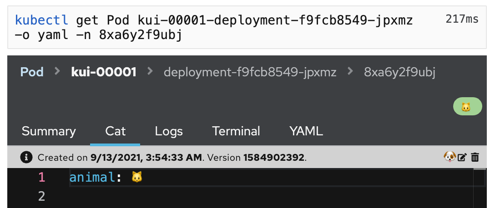
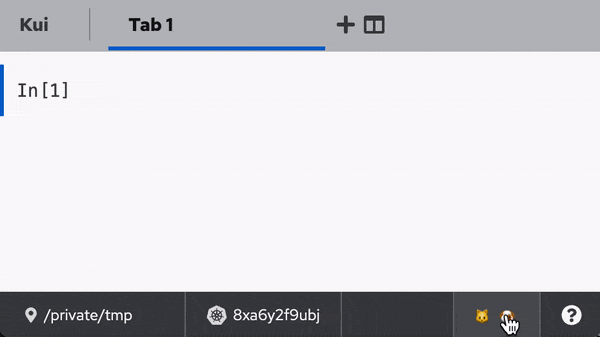

# Client Template for the Kui Graphical CLI Framework

[Kui](https://github.com/kubernetes-sigs/kui) is a framework for
extending CLIs with graphical enhancements.  If you wish to extend the
framework, either by adding custom commands, custom views, or custom
theming, this is the place to start!

This repository offers a few silly animal-oriented commands and views,
including a way to decorate Kubernetes resources with additional tabs.

## Getting Started with Development

```sh
npm ci
npm run watch
```

This will spawn the Webpack watcher. Once it has finished loading, you
may open a Kui window via `npm run open`. If this works, you are all
set for developing your Kui-based magic.

## Details of the customizations in this client

This [wiki](https://github.com/kubernetes-sigs/kui/wiki) introduces
the ways in which this application enhances Kui. In particular, this
client extends Kui with:



- Decorations for Kubernetes resources: a `Cat` tab, a 🐶 button, and a 🐱 badge (shown in the upper right with a green background).

- A set of
  [commands](plugins/plugin-example/src/commands)
  that use Kui's built-in views. [More info](https://github.com/kubernetes-sigs/kui/wiki#approaches-for-enhancing-kui)
  - `hello cat` and `hello dog` are simple hello worlds that returns a cat and dog emoji, respectively
  - `hello sidenav` and `hello catnav` which show how to use the multi-tab "sidecar" views, with tabs on top
     and tabs on the left, respectively



- A [StatusStripe widget](plugins/plugin-example/src/view/CatDogWidget.tsx) that will be placed along the bottom of the Kui window. [More info](https://github.com/kubernetes-sigs/kui/wiki#approaches-for-enhancing-kui)

### More Documentation on Extending Kui

- [Kui Command Documentation](https://github.com/kubernetes-sigs/kui/wiki/1.-Commands) and [Terminal View Documentation](https://github.com/kubernetes-sigs/kui/wiki/2a.-Terminal-View) uses the [string](plugins/plugin-example/src/view/string), [boolean](plugins/plugin-example/src/view/boolean), and [table](plugins/plugin-example/src/view/table) view as examples of Terminal-oriented command response.

- [TopNavSidecar View Documentation](https://github.com/kubernetes-sigs/kui/wiki/2b.-TopNavSidecar-View) uses [this](plugins/plugin-example/src/view/mmr-example.ts) as an example of TopNavSidecar-oriented command response.

- [LeftNavSidecar View Documentation](https://github.com/kubernetes-sigs/kui/wiki/2c.-LeftNavSidecar-View) uses [this](plugins/plugin-example/src/view/nav-example.ts) as an example of LeftNavSidecar-oriented command response.

## Building for Production: Electron Double-clickables

If you want to build and distribute your own double-clickable
Electron-based clients, then use one of these commands, after which
your clients will be placed in `./dist/electron`.

```sh
npm run build:electron:all # does all of the following...
npm run build:electron:mac:amd64
npm run build:electron:mac:arm64
npm run build:electron:linux:amd64
npm run build:electron:linux:arm64
npm run build:electron:windows:amd64
```

## Building for Production: Hosted Web App

To build a hosted version of Kui, running in a Docker container, use
this command:

```sh
npx kui-build-docker-with-proxy
```

This will generate a Docker image `kui-shell/kui`. To test this
production web app, you can use the script `npx kui-run-cproxy`, and
then visit `http://localhost:9080`.
