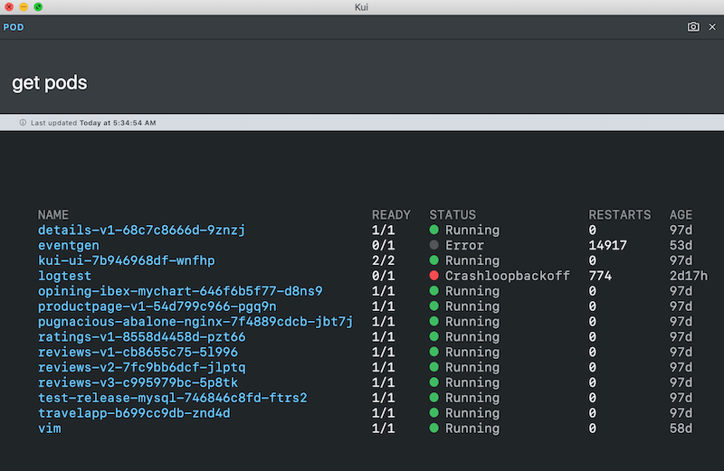
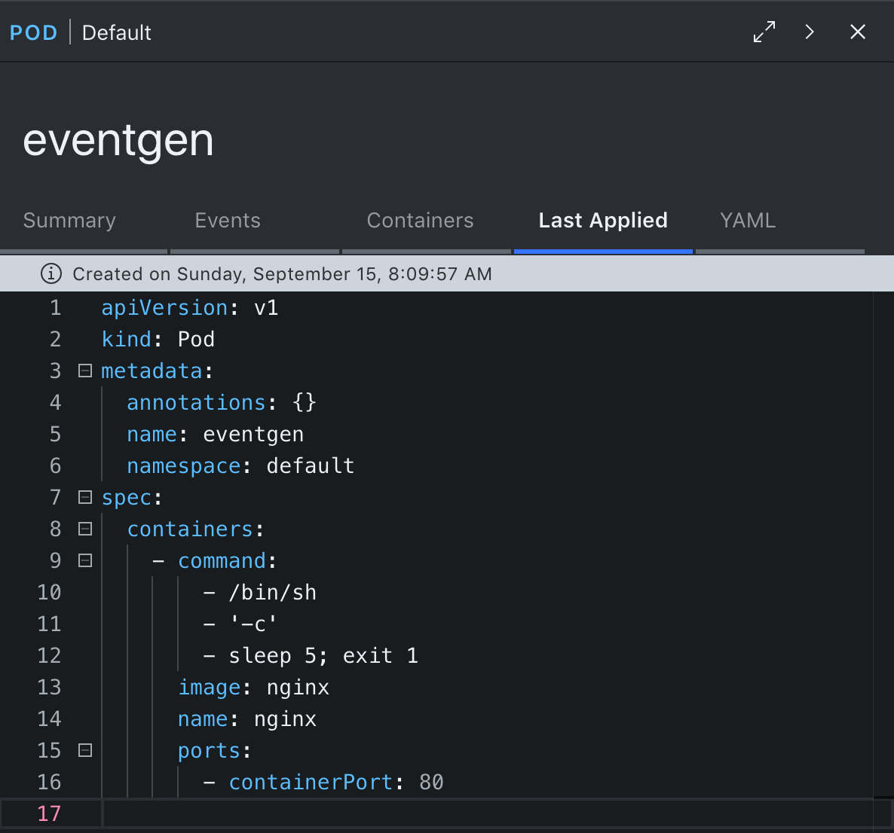

# Kubernetes UI Plugin for Kui

[](https://travis-ci.org/kui-shell/plugin-kubeui)
[](https://opensource.org/licenses/Apache-2.0)

This project offers a kubectl plugin that offers graphical popups in
response to normal `kubectl` commands. It leverages the
[Kui](https://github.com/IBM/kui) project.

For example, `kubectl kubeui get pods` will pop up a window that
[displays a table with clickable pod
names](docs/kubeui-popup.png).  Upon
clicking a pod name, you should see a detail view similar to the [pod
detail screenshot](docs/kubeui-pod-detail.png) below.

# Prebuilt Images

You may choose to consume prebuilt images: download and extract into
your `~/.krew/bin`, make sure that directory is on your PATH, then
issue `kubectl kubeui get pods`.

[Latest Release](https://github.com/kui-shell/plugin-kubeui/releases/latest/) **|** [Mac](https://kubeui.kui-shell.org/v0.0.7/Kui-darwin-x64.tar.gz) **|** [Linux](https://kubeui.kui-shell.org/v0.0.7/Kui-linux-x64.tar.gz)

# Code and Contribute

```bash
git clone https://github.com/kui-shell/plugin-kubeui && cd plugin-kubeui
npm ci
npm start
```

You should see a window come up. You can now try, for example,
`kubectl get pods`, and expect to see a table, similar to that in the
above screenshot. This development client popup has an integrated
terminal. You may issue rapid-fire commands within this terminal, so
that you can test out a variety of commands in quick succession.



## Edit-debug Loop

This project is coded in [TypeScript](https://www.typescriptlang.org).
You may launch a TypeScript watcher via:

```
npm run watch
```

The edit-debug loop involves: edit and save a source change; wait for
the TypeScript compiler to recompile your source changes; finally, in
most cases a simple reload (via Ctrl+R, or Command+R on macOS) of the
development client suffices to integrate your changes into an
already-open window.

## Building a Distribution

To pack up a set of platform clients for subsequent distribution, you
may leverage several npm targets expressed in the
[package.json](package.json):

This command will build a macOS tarball, and place it in
`dist/electron/Kui-darwin-x64.tar.bz2`:

```sh
npm run build:electron:mac
```

To enable your already-built bundles as kubectl plugins, this script
amends those archives with a simple `kubectl-kubeui` script front end:

```sh
./bin/amend-dist-for-krew.sh
```

Or, you can build kubectl-enabled archives for all known platforms via:

```sh
npm run build:krew
```

### Theming

You have the option to customize the theming in several ways. Here are
some of the choices you can influence:

- client name
- client icon
- default theme
- available themes

These changes are captured in the `theme/` subdirectory. More details
coming soon. For now, browse the [theme.json](theme/theme.json) file.
